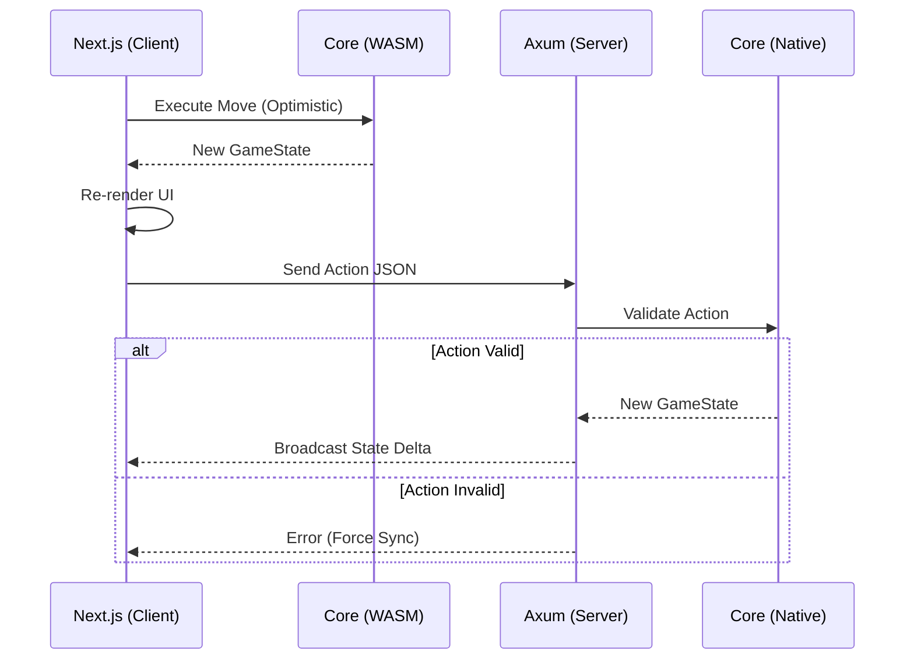

## Game Overview

Palmietopia is a web turn-based strategy game that allows up to 5 players to control their units on a hexagonal tile grid. Each player controls a "civilization" that can build and move units, explore the map, build tech trees, and engage in combat. The map has different terrains, resources, and obstacles that affect gameplay, and there are five map sizes - tiny, small, medium, large, and huge. Players can communicate through a public chat, and the game supports multiplayer over the internet. 

## Architecture

Palmietopia implements a **Shared Logic** architecture (Monorepo). This pattern ensures deterministic game rules by defining state transitions in a single Rust library that compiles to both WebAssembly (for the Client) and Native code (for the Server).

### 1. Core Logic (`/palmietopia-core`)
**Role:** Shared Library & State Machine
* **Stack:** Pure Rust (`no_std` compatible where possible).
* **Compilation Targets:** `cdylib` (WASM) and `rlib` (Native).
* **Responsibilities:** 
    * Defines all domain structs: `GameState`, `Hex`, `Unit`, `City`.
    * Implements deterministic state transition functions (e.g., `move_unit`, `resolve_combat`).
    * **Constraint:** Contains zero rendering, networking, or IO logic.

### 2. Frontend (`/palmietopia-web`)
**Role:** Presentation & Interaction Layer
* **Stack:** Next.js (TypeScript), React, Tailwind CSS, `wasm-bindgen`.
* **Responsibilities:**
    * **State Bridge:** Instantiates the WASM module to maintain a local replica of `GameState`.
    * **Rendering:** Projects the hex grid data into SVG/Canvas elements.
    * **Optimistic Execution:** Executes moves locally via WASM for immediate UI feedback before network confirmation.

### 3. Backend (`/palmietopia-server`)
**Role:** Authoritative Game Server
* **Stack:** Rust, Axum, Tokio, WebSockets.
* **Responsibilities:**
    * **Validation:** Imports `palmietopia-core` natively to validate incoming Move Commands against the authoritative state.
    * **Synchronization:** Broadcasts state deltas to connected clients via WebSockets.
    * **Persistence:** Serializes and commits game state to the database (Postgres/Supabase).

### Data Flow

## Game Details

### Terrain Types

The game features five distinct terrain types, each with unique visual representation and movement costs:

| Terrain | Color | Hex Code | Movement Cost | Properties |
|---------|-------|----------|---------------|------------|
| Grassland | Light Green | #7CB342 | 1 | Basic terrain, good for settlements |
| Forest | Dark Green | #2E7D32 | 1 | Provides resources, tree decorations |
| Mountain | Gray | #757575 | 2 | Rough terrain, snow-capped peaks |
| Water | Royal Blue | #1976D2 | Impassable | Cannot be traversed by land units |
| Desert | Sandy Brown | #F57C00 | 1 | Harsh terrain, sand dune patterns |

### Map Sizes

Palmietopia supports five different map sizes using a hexagonal grid layout:

| Size | Radius | Tile Count | Description |
|------|--------|------------|-------------|
| Tiny | 2 | 19 | Quick games, close combat |
| Small | 4 | 61 | Fast-paced strategy |
| Medium | 6 | 127 | Balanced gameplay |
| Large | 8 | 217 | Epic conflicts |
| Huge | 10 | 331 | Maximum strategic depth |

**Formula:** Total tiles = `3 × radius × (radius + 1) + 1`

### Hex Coordinate System

The game uses **axial coordinates** (q, r) for the hexagonal grid:
- **q**: Horizontal axis (left-right)
- **r**: Diagonal axis (upper-left to lower-right)
- **Orientation**: Pointy-top (hexagons point upward)

This coordinate system simplifies calculations for movement, distance, and neighbor finding while maintaining a compact representation of the map.

## Cities

Cities are the foundation of each player's civilization.

### City Properties
- Each player starts with **1 Capitol city** (marked with a flag)
- Cities can only be placed on **Grassland**, **Forest**, or **Desert** tiles
- Cities **cannot** be placed on Water or Mountain tiles

### Capitol Cities
- The starting city is always the **Capitol**
- Losing your Capitol means **elimination** from the game
- When a Capitol is captured:
  - The defending player is eliminated
  - All their cities transfer to the conquerer
  - All their units are removed from the game
  - They can no longer take turns

### Starting Position Algorithm
Players' starting cities are distributed evenly across the map:
- **2 players**: Opposite sides of the map (180° apart)
- **3 players**: Triangle formation (120° apart)
- **4 players**: Square formation (90° apart)
- **5 players**: Pentagon formation (72° apart)

The algorithm finds valid tiles (non-water, non-mountain) closest to the target direction while maintaining minimum distance from other players' starting positions.

## Economy

Palmietopia features a gold-based economy for unit production.

### Gold

| Setting | Value |
|---------|-------|
| Starting Gold | 50 |
| Base Income | +20 per turn |

- Gold is displayed in the game header
- Income is granted at the **start of each turn**
- Gold is used to purchase units from cities

### Unit Production

Each city can produce **1 unit per turn**:
- Click a city you own to select it
- Click "Buy" to purchase a unit (if you have enough gold)
- The city must be **unoccupied** (no unit on the tile)
- New units spawn with **0 movement** (can't act on the turn they're created)
- Production resets at the start of your turn

**Unit Costs:**

| Unit | Cost |
|------|------|
| Conscript | 25 gold |
| Knight | 40 gold |
| Bowman | 25 gold |

**Strategic Note:** Since units start in your Capitol, you must move your starting unit out before you can produce more. This creates an early-game decision between defending (garrisoned unit) and expanding (producing more units).

## Units

Palmietopia features three unit types with distinct roles and stats:

| Unit | Cost | HP | Attack | Defense | Movement | Range |
|------|------|-----|--------|---------|----------|-------|
| Conscript | 25g | 50 | 25 | 15 | 2 | 1 |
| Knight | 40g | 50 | 35 | 10 | 3 | 1 |
| Bowman | 25g | 40 | 22 | 10 | 2 | 2 |

### Conscript (Basic Infantry)

The Conscript is the balanced starting unit - solid stats across the board.

- **Role:** Frontline infantry, good for holding positions
- Each player starts with **1 Conscript** in their Capitol city

### Knight (Cavalry)

The Knight is a fast, hard-hitting unit with lower defense.

- **Role:** Flanking and pursuit, high damage but fragile
- **Movement:** 3 tiles per turn allows fast repositioning
- **Tradeoff:** Lower defense (10) means they die quickly in prolonged fights

### Bowman (Ranged)

The Bowman can attack from 2 tiles away and receives no counterattack at range.

- **Role:** Support unit, safe chip damage from distance
- **Range:** Can attack at distance 1 or 2
- **Key mechanic:** Attacks at distance 2 receive **NO counterattack**
- **Tradeoff:** Lower HP (40) and defense (10) makes them vulnerable if caught

### Movement Rules

- Movement resets to full at the start of each player's turn
- Moving to Grassland, Forest, or Desert costs **1 movement**
- Moving to Mountain costs **2 movement**
- **Cannot move to Water tiles** at all
- Cannot move to tiles occupied by other units

### Unit Actions

**Fortify**
- Heals the unit for **25% of max HP**
- Requires **full movement** - cannot fortify after moving
- Consumes all remaining movement
- Useful for recovering damaged units in safe positions

## Combat System

Palmietopia uses a **Civilization V inspired** combat system where both attacker and defender deal damage to each other.

### Combat Mechanics

When Unit A attacks Unit B:
1. **A deals damage to B**: `A.attack × 30 ÷ (30 + B.effective_defense)`
2. **B counterattacks A**: `B.attack × 30 ÷ (30 + A.defense) × 0.5` *(melee only)*
3. If either unit reaches 0 HP, they are removed from the game
4. If defender dies, attacker moves to their tile
5. Attacking consumes **all remaining movement**

### Ranged Combat

Bowmen can attack at range 2 with a special benefit:
- **Melee attacks (distance 1):** Normal counterattack applies
- **Ranged attacks (distance 2):** **NO counterattack** - the defender cannot fight back

This makes Bowmen excellent for:
- Softening up targets before melee engagement
- Finishing off low-HP enemies safely
- Kiting enemies (attack, move away, repeat)

### Garrison Bonus

Units standing on a **friendly city** receive a **+50% defense bonus**:
- Conscript base defense: 15
- Conscript garrisoned defense: 22 (15 + 7)

This makes defending cities significantly easier than attacking them.

### Combat Example

**Scenario:** Conscript A (100 HP, 20 ATK, 15 DEF) attacks Conscript B who is garrisoned (100 HP, 20 ATK, 22 effective DEF)

1. A deals to B: `20 × 30 ÷ (30 + 22) = 11 damage`
2. B counterattacks A: `20 × 30 ÷ (30 + 15) × 0.5 = 6 damage`
3. **Result:** A has 94 HP, B has 89 HP

### City Capture

To capture an enemy city:

**Undefended City:**
- Simply move your unit onto the city tile
- The city ownership transfers to you immediately

**Defended City:**
1. Attack and defeat the defending unit
2. Your unit automatically moves to the city tile after killing the defender
3. The city ownership transfers to you

In both cases, if the captured city was their **Capitol**, the player is **eliminated**.

## Victory Conditions

The game ends when only **one player remains** (all others have been eliminated).

A player is eliminated when:
- Their **Capitol city** is captured by an enemy unit
- All their cities and units are then transferred/removed

The last remaining player wins the game and sees a **Victory screen**.

## Timer System

Palmietopia uses a **chess clock** style timer system:

| Setting | Value |
|---------|-------|
| Base Time | 2 minutes |
| Increment | +45 seconds per turn |

**How it works:**
- Each player starts with 2 minutes in their time bank
- Time only counts down during your turn
- When you end your turn, you receive +45 seconds added to your remaining time
- If your time runs out, your turn ends automatically
- Eliminated players are skipped in turn order

**Example:**
1. Player starts turn with 2:00
2. Takes 30 seconds, ends turn with 1:30 remaining
3. Receives +45 second increment
4. Next turn starts with 2:15 in bank

## Multiplayer

### Lobby System
- Create or join game lobbies
- Choose map size when creating a lobby
- 2-5 players supported
- Host can start game when 2+ players have joined

### WebSocket Communication
Real-time game state synchronization via WebSocket connections. Messages include:
- Lobby updates (create, join, leave)
- Game start with initial state
- Turn changes with timer updates
- Unit movement broadcasts
- Combat results with damage dealt
- Player elimination notifications
- Victory announcements

### Player States
- **Active**: Currently playing
- **Eliminated**: Lost their Capitol, shown grayed out in player list
- **Disconnected**: Can rejoin via the game URL
