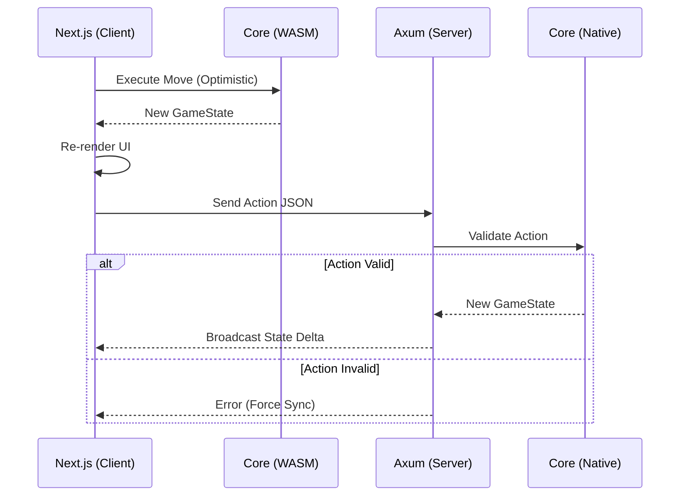

## Game Overview

Palmietopia is a web turn-based strategy game that allows up to 5 players to control their units on a hexagonal tile grid. Each player controls a "civilization" that can build and move units, explore the map, build tech trees, and engage in combat. The map has different terrains, resources, and obstacles that affect gameplay, and there are five map sizes - tiny, small, medium, large, and huge. Players can communicate through a public chat, and the game supports multiplayer over the internet. 

## Architecture

Palmietopia implements a **Shared Logic** architecture (Monorepo). This pattern ensures deterministic game rules by defining state transitions in a single Rust library that compiles to both WebAssembly (for the Client) and Native code (for the Server).

### 1. Core Logic (`/palmietopia-core`)
**Role:** Shared Library & State Machine
* **Stack:** Pure Rust (`no_std` compatible where possible).
* **Compilation Targets:** `cdylib` (WASM) and `rlib` (Native).
* **Responsibilities:** 
    * Defines all domain structs: `GameState`, `Hex`, `Unit`.
    * Implements deterministic state transition functions (e.g., `move_unit`, `resolve_combat`).
    * **Constraint:** Contains zero rendering, networking, or IO logic.

### 2. Frontend (`/palmietopia-web`)
**Role:** Presentation & Interaction Layer
* **Stack:** Next.js (TypeScript), React, Tailwind CSS, `wasm-bindgen`.
* **Responsibilities:**
    * **State Bridge:** Instantiates the WASM module to maintain a local replica of `GameState`.
    * **Rendering:** Projects the hex grid data into SVG/Canvas elements.
    * **Optimistic Execution:** Executes moves locally via WASM for immediate UI feedback before network confirmation.

### 3. Backend (`/palmietopia-server`)
**Role:** Authoritative Game Server
* **Stack:** Rust, Axum, Tokio, WebSockets.
* **Responsibilities:**
    * **Validation:** Imports `palmietopia-core` natively to validate incoming Move Commands against the authoritative state.
    * **Synchronization:** Broadcasts state deltas to connected clients via WebSockets.
    * **Persistence:** Serializes and commits game state to the database (Postgres/Supabase).

### Data Flow

## Game Details

### Terrain Types

The game features five distinct terrain types, each with unique visual representation:

| Terrain | Color | Hex Code | Properties |
|---------|-------|----------|------------|
| Grassland | Light Green | #90EE90 | Basic terrain, good for settlements |
| Forest | Dark Green | #228B22 | Provides resources, may slow movement |
| Mountain | Gray | #808080 | Difficult terrain, defensive advantage |
| Water | Royal Blue | #4169E1 | Impassable for land units, naval routes |
| Desert | Sandy Brown | #F4A460 | Harsh terrain, limited resources |

### Map Sizes

Palmietopia supports five different map sizes using a hexagonal grid layout:

| Size | Radius | Tile Count | Description |
|------|--------|------------|-------------|
| Tiny | 2 | 19 | Quick games, close combat |
| Small | 4 | 61 | Fast-paced strategy |
| Medium | 6 | 127 | Balanced gameplay |
| Large | 8 | 217 | Epic conflicts |
| Huge | 10 | 331 | Maximum strategic depth |

**Formula:** Total tiles = `3 × radius × (radius + 1) + 1`

### Hex Coordinate System

The game uses **axial coordinates** (q, r) for the hexagonal grid:
- **q**: Horizontal axis (left-right)
- **r**: Diagonal axis (upper-left to lower-right)
- **Orientation**: Pointy-top (hexagons point upward)

This coordinate system simplifies calculations for movement, distance, and neighbor finding while maintaining a compact representation of the map.
