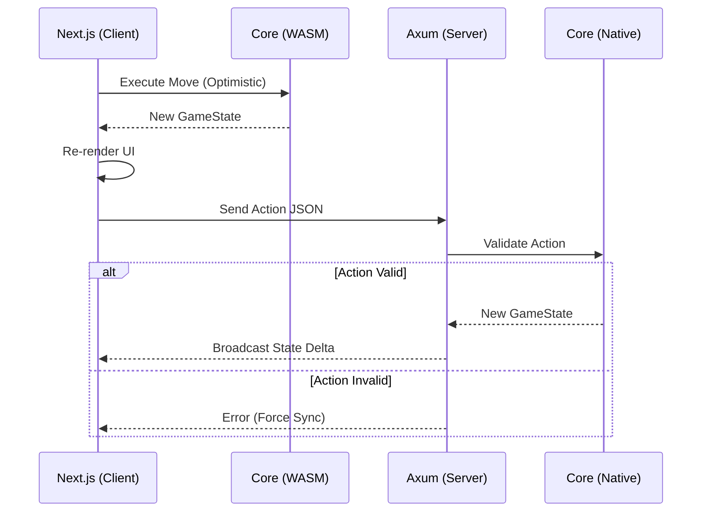

## Game Overview

Palmietopia is a web turn-based strategy game that allows up to 5 players to control their units on a hexagonal tile grid. Each player controls a "civilization" that can build and move units, explore the map, build tech trees, and engage in combat. The map has different terrains, resources, and obstacles that affect gameplay, and there are five map sizes - tiny, small, medium, large, and huge. Players can communicate through a public chat, and the game supports multiplayer over the internet. 

## Architecture

Palmietopia implements a **Shared Logic** architecture (Monorepo). This pattern ensures deterministic game rules by defining state transitions in a single Rust library that compiles to both WebAssembly (for the Client) and Native code (for the Server).

### 1. Core Logic (`/palmietopia-core`)
**Role:** Shared Library & State Machine
* **Stack:** Pure Rust (`no_std` compatible where possible).
* **Compilation Targets:** `cdylib` (WASM) and `rlib` (Native).
* **Responsibilities:** 
    * Defines all domain structs: `GameState`, `Hex`, `Unit`, `City`.
    * Implements deterministic state transition functions (e.g., `move_unit`, `resolve_combat`).
    * **Constraint:** Contains zero rendering, networking, or IO logic.

### 2. Frontend (`/palmietopia-web`)
**Role:** Presentation & Interaction Layer
* **Stack:** Next.js (TypeScript), React, Tailwind CSS, `wasm-bindgen`.
* **Responsibilities:**
    * **State Bridge:** Instantiates the WASM module to maintain a local replica of `GameState`.
    * **Rendering:** Projects the hex grid data into SVG/Canvas elements.
    * **Optimistic Execution:** Executes moves locally via WASM for immediate UI feedback before network confirmation.

### 3. Backend (`/palmietopia-server`)
**Role:** Authoritative Game Server
* **Stack:** Rust, Axum, Tokio, WebSockets.
* **Responsibilities:**
    * **Validation:** Imports `palmietopia-core` natively to validate incoming Move Commands against the authoritative state.
    * **Synchronization:** Broadcasts state deltas to connected clients via WebSockets.
    * **Persistence:** Serializes and commits game state to the database (Postgres/Supabase).

### Data Flow

## Game Details

### Terrain Types

The game features five distinct terrain types, each with unique visual representation and movement costs:

| Terrain | Color | Hex Code | Movement Cost | Properties |
|---------|-------|----------|---------------|------------|
| Grassland | Light Green | #7CB342 | 1 | Basic terrain, good for settlements |
| Forest | Dark Green | #2E7D32 | 1 | Provides resources, tree decorations |
| Mountain | Gray | #757575 | 2 | Rough terrain, snow-capped peaks |
| Water | Royal Blue | #1976D2 | Impassable | Cannot be traversed by land units |
| Desert | Sandy Brown | #F57C00 | 1 | Harsh terrain, sand dune patterns |

### Map Sizes

Palmietopia supports five different map sizes using a hexagonal grid layout:

| Size | Radius | Tile Count | Description |
|------|--------|------------|-------------|
| Tiny | 2 | 19 | Quick games, close combat |
| Small | 4 | 61 | Fast-paced strategy |
| Medium | 6 | 127 | Balanced gameplay |
| Large | 8 | 217 | Epic conflicts |
| Huge | 10 | 331 | Maximum strategic depth |

**Formula:** Total tiles = `3 × radius × (radius + 1) + 1`

### Hex Coordinate System

The game uses **axial coordinates** (q, r) for the hexagonal grid:
- **q**: Horizontal axis (left-right)
- **r**: Diagonal axis (upper-left to lower-right)
- **Orientation**: Pointy-top (hexagons point upward)

This coordinate system simplifies calculations for movement, distance, and neighbor finding while maintaining a compact representation of the map.

## Cities

Cities are the foundation of each player's civilization.

### City Properties
- Each player starts with **1 Capital city**
- Cities can only be placed on **Grassland**, **Forest**, or **Desert** tiles
- Cities **cannot** be placed on Water or Mountain tiles

### Starting Position Algorithm
Players' starting cities are distributed evenly across the map:
- **2 players**: Opposite sides of the map (180° apart)
- **3 players**: Triangle formation (120° apart)
- **4 players**: Square formation (90° apart)
- **5 players**: Pentagon formation (72° apart)

The algorithm finds valid tiles (non-water, non-mountain) closest to the target direction while maintaining minimum distance from other players' starting positions.

## Units

### Conscript (Basic Warrior)

The Conscript is the most basic military unit available at game start.

| Stat | Value |
|------|-------|
| Movement | 2 tiles per turn |
| Water | Cannot traverse |
| Mountain | Costs 2 movement (rough terrain) |

**Movement Rules:**
- Each player starts with **1 Conscript** adjacent to their starting city
- Movement resets to full (2) at the start of each player's turn
- Moving to Grassland, Forest, or Desert costs **1 movement**
- Moving to Mountain costs **2 movement** (can only move 1 tile per turn on mountains)
- **Cannot move to Water tiles** at all
- Cannot move to tiles occupied by other units

## Timer System

Palmietopia uses a **chess clock** style timer system:

| Setting | Value |
|---------|-------|
| Base Time | 2 minutes |
| Increment | +45 seconds per turn |

**How it works:**
- Each player starts with 2 minutes in their time bank
- Time only counts down during your turn
- When you end your turn, you receive +45 seconds added to your remaining time
- If your time runs out, your turn ends automatically

**Example:**
1. Player starts turn with 2:00
2. Takes 30 seconds, ends turn with 1:30 remaining
3. Receives +45 second increment
4. Next turn starts with 2:15 in bank

## Multiplayer

### Lobby System
- Create or join game lobbies
- Choose map size when creating a lobby
- 2-5 players supported
- Host can start game when 2+ players have joined

### WebSocket Communication
Real-time game state synchronization via WebSocket connections. Messages include:
- Lobby updates (create, join, leave)
- Game start with initial state
- Turn changes with timer updates
- Unit movement broadcasts

